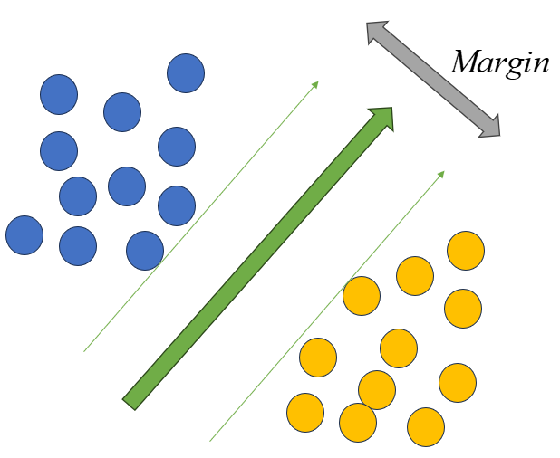

# 支持向量機 (support vector machine) 
先前我們做了一些各式各樣的regression，

有試圖去改善欠擬合的

也有遇到過擬合的狀況，我們再使用了正則化

那現在有沒有一個大補包，比較系統化，又期望它很有效率的，有的，它就是今天要介紹的SVM

根基於Linear programing可以很有效率的解決問題，而且SVM的技術也發展的很純熟

把線性可以做得到的事情最大化

<p align="center">
  
</p>

如果今天是在二維數據裡面做二分類的問題，我們就是在找一條線去割開這兩個分類

那甚麼樣的線是比較好的？我們肯定是希望從這條線盡量把兩個數據分的越開越好

也就是如果今天有新的數據加入，這條線比較不會因為隨機樣本點的擾動被影響，比較有魯棒性 (Robustness)

就很像是我們在這個兩個數據間找一條馬路，馬路的中間就是所謂的超平面，馬路的邊邊叫作support vector

所以我們可以想像成最大化這個邊界(Margin)越寬越好

$$Ma{x_w}\ {{wx' + b} \over {\left| w \right|}}$$

$$subject\ to\ wx + b = 0$$

在這邊 $x'$ 就是input的數據，已經被給定所以是個常數，後面我們把它去掉來簡化

我們還要加入一下標籤y的資訊，從相關性的角度入手，就是對我們的分類線 $wx+b$做內積。也就是說，當點落在線上面我們就說這是+1；點落在下面就說是-1

物理意義也就是support vector外的都是某一類分類，讓約束條件更簡潔一些

再來我們運用一下數學性質來設定我們要怎麼列下不等式：如果 $w',b'$ 是最佳解，那麼 $cw',cb'$ 即縮放也會是最佳解，所以我們隨便選一個數字，例如1作為約束的值來簡化問題

$$y(wx+b) \ge 1$$


在最優化問題裡面objective function有一些等價的表述，我們去絕對值後，後續在數學的處理上會有一些好處(不會有尖點的問題)

$$Ma{x_w}\ \ {1 \over {\left| w \right|}} = Mi{n_w}w{\rm{ }} = Mi{n_w}{1 \over 2}{w^2}$$

$$subject \  to \  y \left( {wx + b} \right) \ge 1$$

以上就是我們要處理的問題，這個在線性規劃(Linear programming)裡

是屬於凸二次規劃(Convex quadratic programming)問題

$$
\begin{array}{cl}
\min _{\boldsymbol{u}} & \frac{1}{2} \boldsymbol{u}^{\top} \boldsymbol{Q} \boldsymbol{u}+\boldsymbol{t}^{\top} \boldsymbol{u} \\
\text { s.t. } & \boldsymbol{c}_i^{\top} \boldsymbol{u} \geq d_i, \quad i=1,2, \ldots, m
\end{array}
$$

只要丟到Linear programming的包裡面就可以解 

$$
\begin{gathered}
\boldsymbol{u}:=\left[\begin{array}{c}
\boldsymbol{w} \\
b
\end{array}\right], \boldsymbol{Q}:=\left[\begin{array}{ll}
\boldsymbol{I} & \mathbf{0} \\
\mathbf{0} & 0
\end{array}\right], \boldsymbol{t}:=\mathbf{0} \\
\boldsymbol{c}_i:=y_i\left[\begin{array}{c}
\boldsymbol{x}_i \\
1
\end{array}\right], d_i:=1
\end{gathered}
$$

python: cvxpy

MATLAB: YIMIP+MOSEK

<div align=center></div

以下可以寫個簡單的code跑一下

```
import numpy as np
import matplotlib.pyplot as plt
import cvxpy as cvx

###SVM原型是針對二分類問題
###註解部分拿掉是soft margin

#首先我們需要一些模擬數據
#sample點用(而且它是保證均勻的取 )
def sampling_circle(sample_size,r_sqaure,x_0,y_0):
    a = np.random.uniform(size=sample_size)*r_sqaure
    b = np.random.uniform(size=sample_size)
    x = np.sqrt(a) * np.cos(2 * np.pi * b)+x_0
    y = np.sqrt(a) * np.sin(2 * np.pi * b)+y_0
    return x, y
###模擬數據數量
mock_data_number_list=[50,50]
verify_data_number_list=[50,50]
###種類
k=np.size(mock_data_number_list)
###feature number
n=2
#
N=sum(mock_data_number_list)

#標籤我們後面在依據數量給
def data_generator(mock_data_number,r,x0,y0,label):
  ones=np.ones([1,mock_data_number])
  data1=np.array(sampling_circle(mock_data_number,r**2,x0,y0))
  label_array=label*np.ones([1,mock_data_number])
  plt.scatter(data1[0,:],data1[1,:])
  data1=np.concatenate([ones,data1],0)
  data1=np.concatenate([data1,label_array],0)
  return data1

data1=data_generator(mock_data_number_list[0],0.2,0.3,0.7,1)
data2=data_generator(mock_data_number_list[1],0.2,0.7,0.7,-1)

all_data=np.concatenate([data1,data2],1)


def one_hot(a,k):
  a=a.astype(int)
  return np.eye(k)[a]


def compare_two_array_count(answer,learn_label):
    error_count=0
    for i in range(len(answer)):
        if answer[i]!=learn_label[i]:
            error_count=error_count+1
    return error_count
###print(cvxpy.installed_solvers())

#C=1
x=all_data[1:n+1,:]
y=all_data[-1,:].reshape([1,N])
w=cvx.Variable([1,n])
b=cvx.Variable()
xi=cvx.Variable([N])
obj=cvx.Minimize(cvx.square(cvx.norm(cvx.vec(w))))
#obj=cvx.Minimize(cvx.square(cvx.norm(cvx.vec(w)))+C*cvx.sum(xi))
constraints=[]
constraints.append(cvx.vec(cvx.multiply(y,w@x+b))>=1)
#constraints.append(cvx.vec(cvx.multiply(y,w@x+b))>=1-xi)
#constraints.append(xi>=0)
prob = cvx.Problem(obj,constraints)
prob.solve()
print('sum over w',prob.value)
print('w',w.value)


###plt
plt_x=np.linspace(0.1,0.9,100)
plt.plot(plt_x,-w.value[0,0]/w.value[0,1]*plt_x-b.value/w.value[0,1])
plt.xlim(0,1)
plt.ylim(0,1)

plt.show()

```

# Lagrange multiplier and dual problem

以下就是對這個問題做一些解析上面的分析，看看寫成這樣的問題可以帶來什麼樣的優勢或者特性

我們把不等式的約化條件換成等式的

先來定義一下 Lagrange multiplier

## Lagrange multiplier

對於一個某一個函數如果我們又知道它的限制，那我們就可以召喚一個縫合怪

$$
\begin{array}{ll}
\min _{\boldsymbol{u}} & f(\boldsymbol{u}) \\
\text { s.t. } & g_i(\boldsymbol{u}) \leq 0, \quad i=1,2, \ldots, m \\
& h_j(\boldsymbol{u})=0, \quad j=1,2, \ldots, n
\end{array}
$$

我們可以找到等價成在另外一個函數優化的問題

$$
L(u, \alpha, \beta) \mid=f(u)+\sum_{i=1}^m \alpha_i g_i+\sum_{j=1}^m \beta_j h_j
$$

其中
$$\alpha  \ge 0$$

## Karush–Kuhn–Tucker conditions (KKT conditions)
在寫成lagrange前的問題我們就叫作主問題

$$Mi{n_{w,b}}Ma{x_{\alpha  \ge 0}}{1 \over 2}w{w^T} + \alpha \sum\limits_i^N {1 - {y_i}\left( {w{x_n} + b} \right)} $$

這邊我們可以看成 $Mi{n_w}{1 \over 2}{w^2}$ 再加上要 Max constraints的部分

意思是解完lagrange的問題要跟原本寫成 $Mi{n_w}{1 \over 2}{w^2}$ 原問題應該要有相同的bound

再來，我們這邊稍微交換一下Max跟min就是對偶問題，先做Max或是先做Min都不影響最優解的答案

$$Mi{n_{\alpha  \ge 0}}Ma{x_{w,b}}{1 \over 2}w{w^T} + \alpha \sum\limits_i^N {1 - {y_i}\left( {w{x_n} + b} \right)} $$

主問題可行: $g,h \le 0$

對偶問題可行: $\alpha \ge 0$

註：這邊的primal跟dual不是指Linear program上的，而是專指對哪個參數先進行優化的想法

數學上我們會有這些不等式存在的時候，但是我們希望解完的答案要跟原問題是一樣的，等式發生的時候我們給它一個名字

complementary slackness: 等式成立的時候 $\alpha_i g_i=0$

## Slatter condiction
只要

$f$ , $g$ 是convex function

$h$ 為affine function

而且可行域有一個約束成立

則對偶問題就可以等價於成原問題

# SVM problem
SVM 符合 slatter condiction，所以我們就可以套入lagrange multiplier

我們可以把原問題改寫成去優化下面的函數

$$L = {1 \over 2}{w^2} + \sum {{\alpha _i}\left( {1 - y\left( {wx + b} \right)} \right)} $$

## KKT condiction
來偏微求導一下
$${{\partial L} \over {\partial w}} = w - \sum {{a_i}\left( {{y_i}{x_i}} \right)}  = 0$$

$${{\partial L} \over {\partial b}} = \sum {{a_i}{y_i}}  = 0$$

還有要形成lagrange的兩個約束

$${\alpha_i} \ge 0$$

$$1 - y\left( {wx + b} \right) \le 0$$

這兩個約束的物理含意就是，支持向量是距離超平面最近的樣本，

$$w=\sum_{i=1}^{m} {\alpha_i} {y_i}{x_i}=\sum_{\alpha_i=0}^{m} 0 {y_i}{x_i}+\sum_{\alpha_i \ge 0}^{m} {\alpha_i} {y_i}{x_i}=\sum_{i \in SV}^{m} {\alpha_i} {y_i}{x_i}$$

如果我們把求導結果的w帶回去可以得到原問題可以寫成

我們就說這是lagrange的dual

$${1 \over 2}\sum\limits_i {\sum\limits_j {{\alpha _i}{\alpha _j}{y_i}{y_j}{x_i}^T} } {x_j} - \sum\limits_i {{\alpha _i}} $$

這就代表著其實求解的問題只跟這些y跟k的之間的內積有關

回顧之前的prmimal可以寫成在linear program內的qudractic的form，

我們可以令一個Gram matrix是這些內積後的向量 $\left( {{x_i}{x_j}} \right)$ 與 $\left( {{y_i}{y_j}} \right)$ 的組合，在寫問題的時候會更加的方便

$$G = {\left( {{x_i}{x_j}} \right)^T}\left( {{y_i}{y_j}} \right)$$

用cvxpy的包寫會更清楚一些
```
objective = cvx.Maximize(cvx.sum(a)-(1/2)*cvx.quad_form(a, G))
constraints = [a <= 0, cp.sum(cp.multiply(a,y)) == 0] # KKT
prob = cp.Problem(objective, constraints)
result = prob.solve()
```
乍看之下構建一個gram matrix 你需要 $O\left( {{n^2}} \right)$ 的複雜度 (n為feature的數量)

但因為gram matrix本身有很多對稱的特性，在數值處理上有很多逼近它的辦法，在運算上也可以省下一些資源

還有這個matrix事實上只跟內積是相關的運算，意思是其實我們不需要開到 $n^2$ 的格子才做這些運算

物理意義是使用內積計算相當於我們執著於 $x$ 跟 $y$ 之間的相關性

接下來我們會介紹Kernal method，我們直接在n的空間內做這些內積的function去做計算

## 核方法 Kernal trick

事實上在前面polynomial regression我們就做了這件事情，

如果我們的特徵空間 ${R^d}$ 不是線性可分的，但一定存在 ${\tilde d} > d$ 令 ${R^d}$ 線性可分

意思說我們可以找到某一種映射(mapping)，讓新的數據可以在新的空間被分開

回顧一下，我們的lagrange的部分可以寫成

$${1 \over 2}\sum\limits_i {\sum\limits_j {{\alpha _i}{\alpha _j}{y_i}{y_j}{x_i}^T} } {x_j} - \sum\limits_i {{\alpha _i}} $$

可以把原本的內積項 ${x_i}^T{x_j}$ 替換成一個映射函數 $\phi ({x_i}^T)\phi ({x_j})$

$$k({x_i},{x_j}) = \langle \phi ({x_i}),\phi ({x_j})\rangle $$

我們就說這個映射函數就是所謂的kernal function

那在什麼情況下要使用那些kernal function呢？

如果今天特徵比樣本還要多，就可能意味著線性應該就可以做的不錯了

如果樣本數眾多，可以直接使用深度學習來篩選特徵

介於中間的時候就可以使用我們後面會介紹的RBF

### Mercer condition

核函數(Kneral)對應的矩 必須為半正定的

$$K: = {\left[ {k\left( {{x_i},{y_j}} \right)} \right]_{m \times m}}$$

也就是說這個矩陣一定可以滿足 $z$ 跟 $z'$ 的 內積相乘

$$K =  < z,z' > $$

### polynomial knernal

先前盡量寫出general的polynomial的例子可以在內積之後看成是

$$\phi ({x_i}^T)\phi ({x_j}) = {\left( {\gamma {x_i}{x_j} + 1} \right)^d}$$

這邊 $\gamma$ 只是控制對相似度辨識的權重，我們先暫時讓它等於1，實作上是去調它讓模型預測更

$$\phi ({x_i}^T)\phi ({x_j}) = {\left( {{x_i}{x_j} + 1} \right)^d}$$

例如說 $$d = 2$$

我們可以得到

$${\left( {{x_i}{x_j}} \right)^2} + 2{x_i}{x_j} + 1$$

向量x寫成

$$x = \left[
\begin{matrix}
x_1\\
x_2\\
\end{matrix}
\right]$$
  
x的映射關係從 ${R^2} \mapsto {R^3}$ 寫成

$$
\phi: x \mapsto\left[\begin{array}{l}
x_1^2 \\
x_2^2 \\
x_1 x_2 \sqrt{2}
\end{array}\right]
$$

### Radial basis function kernel  (RBF)

$$k\left( {{x_i},{x_j}} \right): = \exp \left( { - {{{{\left( {{x_i} - {x_j}} \right)}^2}} \over \gamma }} \right)$$

這裡一樣先讓 $\gamma=1 $

$$k\left( {{x_i},{x_j}} \right): = \exp \left( { - {{\left( {{x_i} - {x_j}} \right)}^2}} \right)$$

物理意義上，這邊可以解釋為 ${x_i} - {x_j}$ 之間的相關性，

當 ${x_i} = {x_j}$時RBF值為1，相差很大的時候RBF為0

映射關係可以寫成，也可以想像成無窮維且收斂的polynomial

$$
\phi: x \mapsto \exp \left(-x^2\right)\left[\begin{array}{c}
1 \\
\sqrt{\frac{2}{1}} x \\
\sqrt{\frac{2^2}{2 !}} x^2 \\
\vdots
\end{array}\right]
$$

這邊可以等價成簡單的泰勒展開，這邊方便閱讀我們寫成 $x$ 跟 $y$

意思是我們在RBF其實也等同於做了一個在無限維度去逼近的效果，但事實上我們只使用到 $n$ 的空間

也就意味著我們以小小的資源，就可以做到很多事情，當然做的準不準因問題而定

$$
k(x, y)=\langle\phi(x), \phi(y)\rangle=e^{-\sigma\|x-y\|^2}=e^{-\sigma\left(x^2-2 x y+y^2\right)}=e^{-\sigma\left(x^2+y^2\right)} e^{\sigma 2 x y}
$$

$$
=e^{-\sigma x^2}\left[\begin{array}{c}
1 \\
\sqrt{\frac{2 \sigma}{1 !}} x \\
\sqrt{\frac{(2 \sigma)^2}{2 !}} x^2 \\
\vdots
\end{array}\right]^T e^{-\sigma y^2}\left[\begin{array}{c}
1 \\
\sqrt{\frac{2 \sigma}{1 !}} y \\
\sqrt{\frac{(2 \sigma)^2}{2 !}} y^2 \\
\vdots
\end{array}\right]
$$

每一個element

$$
e_n(x)=\sqrt{\frac{(2 \sigma)^n}{n !}} x^n e^{-\sigma x^2}, n=0,1,2, \ldots
$$

當然，這只是單個 $x$，如果有 $d$ 個features，整體就寫成

<div align=center></div

RBF的實作先留個坑

## Soft margin

假如今天樣本身就是有一些錯誤，一些noise
例如說我把前面的點有些重合，它們是線性不可分的

```
data1=data_generator(mock_data_number_list[0],0.3,0.3,0.7,1)
data2=data_generator(mock_data_number_list[1],0.3,0.7,0.7,-1)
```
這個時候解下去通常是infeasible

我們可以改寫一下優化函數與條件，讓今天分類後的w是有一定的錯誤容忍度，更加有robustness

<div align=center></div

其中

$I$ 為indicator function， $C$ 是用來權衡附加條件與原本的目標函數的參數

$$s.t.\ {y_i}\left( {{w^T}\phi \left( x \right) + b} \right) \ge 1$$

但這邊有個痛點，就是indicator function不連續，也不是凸函數，

所以我們要在做一些手腳，讓整個東西看起來是線性的

我們可以引入一個slack variable

$$\xi_i=
\left\{\begin{array}{l}
0 \quad, \text { if } y_i\left(w^T \phi(x)+b\right) \geq 1 \\
1-y_i\left(w^T \phi\left(x_i\right)+b\right), \text { else }
\end{array}\right.
$$

新的lagrange寫成
$$L(w,b,\xi,\alpha,\beta)=\frac{1}{2}w^Tw+C\sum_{i=1}^m\xi\\+\sum_{i=1}^m\alpha_i(1-\xi_i-y_i(w^T\phi(x_i)+b))+\sum_{i=1}^m\beta_i(-\xi_i)$$


求偏導
$$\frac{\partial L}{\partial w}=0  \Rightarrow w= \sum_{i=1}^{m} \alpha_i y_i \phi(x_i)$$
$$\frac{\partial L}{\partial b}=0  \Rightarrow w= \sum_{i=1}^{m} \alpha_i y_i =0$$
$$\frac{\partial L}{\partial \xi}=0  \Rightarrow \alpha_i+\beta_i=C$$


然後dual的largange就可以寫出來

$$Mi{n_\alpha }{1 \over 2}\sum\limits_{i = 1}^N \sum\limits_{j = 1}^N {{\alpha _i}{\alpha _j}{y_i}{y_j}x_n^T{x_m}}$$

$$-\sum\limits_{i = 1}^N {{\alpha _i}} $$

$$subject\ to\ \sum\limits_{i = 1}^N {{y_i}{\alpha _i} = 0} ,\ 0 \le {\alpha _i} \le C,for\ i = 1,2,3......$$

當我們加入了這個slack variable，其實只是等同於我們在dual裡面對每一個 $\alpha_i$ 增加了了一個上限C

也就是說相較於原本的dual這邊min裡面扣除的 $\alpha_i$ 有被限制，意味著更寬鬆的邊界或是允許了一些error

最後來看看做的怎麼樣，把前面的code的註解打開就是softmargin的版本

只是添加了一個關於 $\xi$ 的參數
```
C=1
obj=cvx.Minimize(cvx.square(cvx.norm(cvx.vec(w)))+C*cvx.sum(xi))
constraints=[]
constraints.append(cvx.vec(cvx.multiply(y,w@x+b))>=1-xi)
constraints.append(xi>=0)
```


<div align=center></div

搞定！

## Softmargin and regularization

最後一件事情就是原問題其實可以等價成下列，也就是做了一個正則化

從Linea programming的 dual program可以等價成解下面這個問題

$${1 \over m}\sum\limits_{i = 1}^m {\max } \left( {0,1 - {y_i}\left( {{w^{{\rm{T}}}}\phi \left( {{x_i}} \right) + b} \right) + {\lambda  \over 2}{{\left| w \right|}^2}} \right.$$

SVM相關技術已經整合了我們對於要如何處理data的很多想像，

Kneral trick帶來了顯現更多data feature的可能性

Softmargin可以讓整體的預測線條更加smooth，相當於做了正則化

大補包就是如此的棒！
